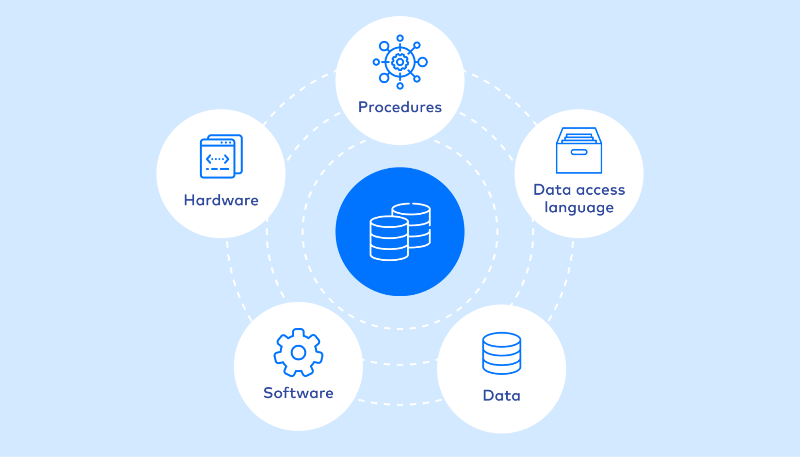
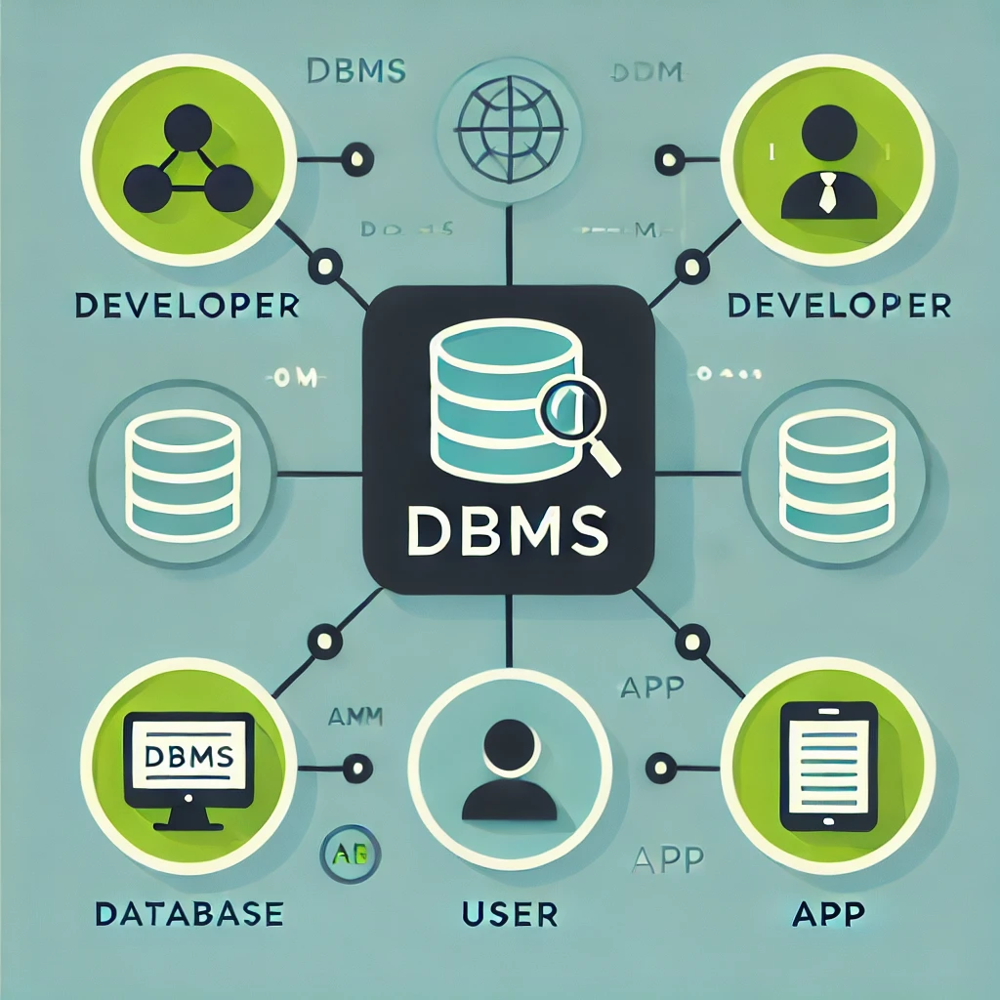
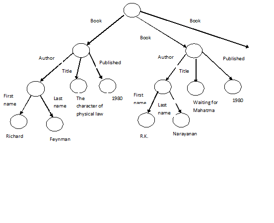
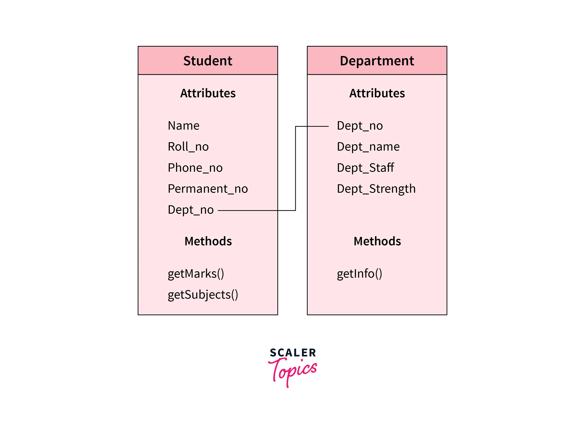
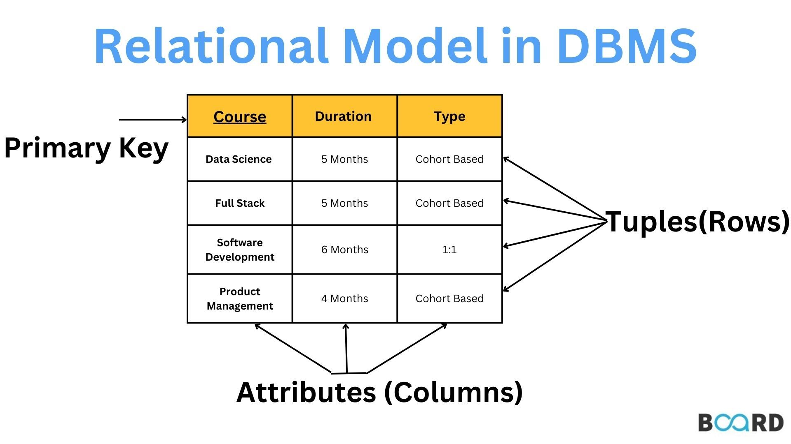
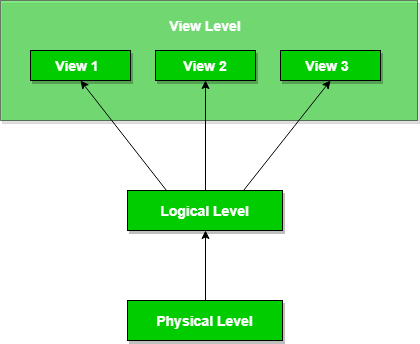
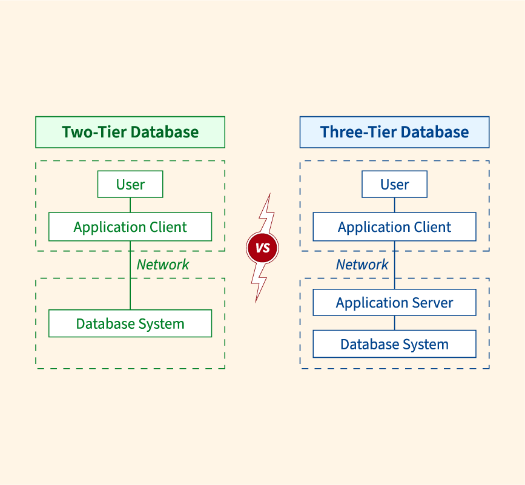
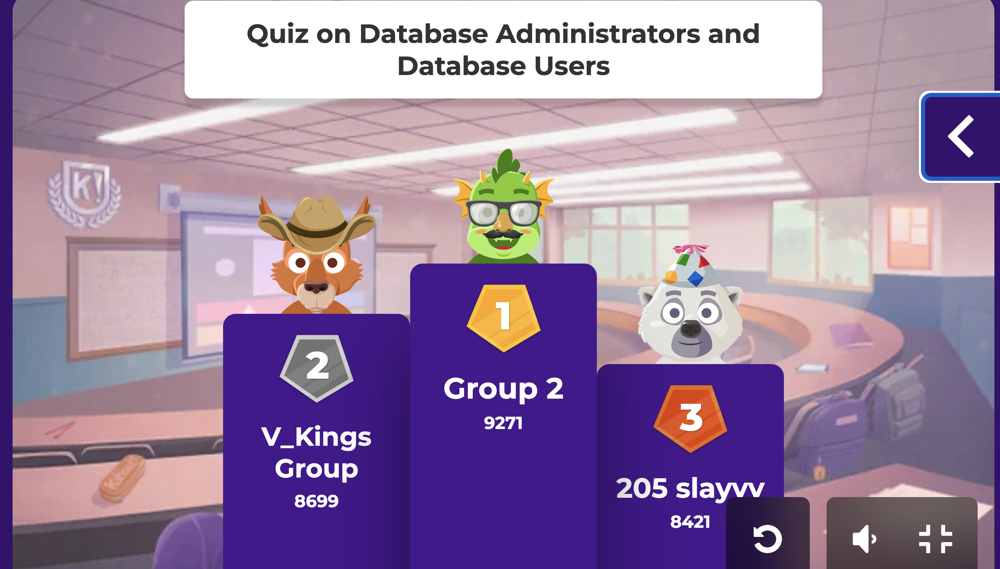
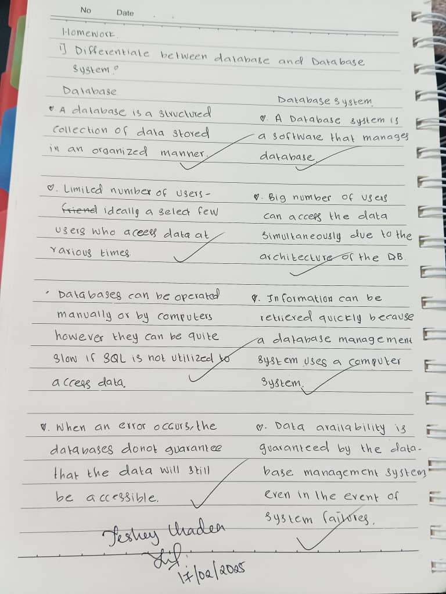

# Highlights
**Database Systems Fundamentals**
   1. Data and Database
      - Definition
      - Purpose
      - Advantages and disadvantages
   
   2.  Database System 
      - Definition
      -  Different types of data models used in database design and languages and their applications
      -  Database system architecture and their components
  
  3. Flipped class
      - Types of database users 
      - key responsibilities of database administrators
  
  4. Homework
    - Differentiate between database and database system

##  Data and Database

  Gathering of the facts is called Data and on other hand gathering of structured infromation is called Database.

**Purpose** 
- The purpose of Data is to unprocessed facts and figures that can be used to support analysis, decision-making, and problem-solving.
- The purpose of a database is to hold, maintain, and organize data in a highly structured way so that it can be easily collected, modified, 
and manipulated and databases are designed to hold very large amounts of data and provide efficient ways of obtaining information, modifying, and deleting.

**Advantages and Disadvantages**
1. Data
 **Advantages**
  - Better Decision-Making
  - Increased Efficiency
  - Improved Record Keeping
  **Disadvantages**
  * Data Overload
  * Security Risks
  * High Storage Costs 

2. Database 
  **Advantages**
  - Efficient Data Management
  - Data Sharing 
  - Reduces Redundancy
  **Disadvantages**
  * High Initial Cost 
  * Data Loss Risk
  * Dependency on Technology

#  Database system

 A Database Management System (DBMS) is a collection of related data and a set of programs that allow access to and management of that data.

**Database systems** = database Management system + Database
**Types**
1. Entity-Relationship Model

-  It is conceptual framework used to represent the structure of a database by illustrating the entities within a system and the relationships between them

2. Semi-structured Data Model

- It is a type of data model that does not have a fixed structure like traditional databases, but still organizes data with tags or markers.

3. Object Based Data Models

- It is database models that represent data as objects, similar to how object-oriented programming  works.

4. Relational Model

- It is a way of structuring and organizing data in a database using a set of tables, or relation where each table consists of several columns, each with a distinct name. Every row within the table represents an individual record or data entry.
- **Sequential Query Language (SQL)**:  refers to a standardized programming language used to manage and manipulate relational databases.

**Data Abstraction**
- Developers hide the complicated details of how data is stored in databases from users.  
- Database systems give developers simplified ways to organize and manage data, making it easier to work with without needing to deal with the complex underlying structure.

1. **Physical level**: shows how the data are actually stored.
2. **Logical level**:shows what data are stored in the database,and what relationships exist among those data.
3. **View level**: shows only part of the entire database.

**Database Design**
1. Select a data model.
2. Create a conceptual design : outlines the functional requirements for the organization.
3. Develop a logical design : translates the broad conceptual schema into the database system's implementation model.
4. Formulate the physical design : defines the physical characteristics and structure of the database.

**Database Instances and Schemas**
- Database Instance: The set of data stored in the database at a specific point in time.
- Database Schema: Overall design of the database

**Database Languages**
1. Data-definition language :Used to define and manage database structures like tables, schemas, and indexes.
2. Data-manipulation language : used to interact with and modify data within a database.
The types of access are:
- Retrieval 
- Insertion
- Deletion
- Modification

**Two types of DMLs**
- Procedural DML: It need a user to specify what data are needed and how to get those data.
- Declarative DMLs (nonprocedural DMLs):Need a user to specify what data are needed without specifying how to get those data.
A query is a statement requesting the retrieval of information.
- The portion of a DML that involves information retrieval is called a query language.

**Database Engine**
- It is the core component of a database management system that handles data storage, retrieval, and management. It processes SQL queries, manages transactions, and ensures data integrity.
main components of a database engine:

1. Storage Manager
- Acts as an interface between the physical data storage and the database system.
- Handles file organization, indexing, and access methods.
- Manages data buffering and caching for efficient retrieval.

2. Query Processor
- Responsible for interpreting and executing SQL queries.
DDL Interpreter :  Processes Data Definition Language (DDL) commands.
DML Compiler :  Converts Data Manipulation Language (DML) queries into an execution plan.
Query Evaluation Engine : Optimizes and executes queries efficiently.

3. Transaction Management
- Ensures ACID (Atomicity, Consistency, Isolation, Durability) properties for database transactions.
Concurrency-Control Manager : Prevents conflicts when multiple users access the database.
Recovery Manager : Handles database restoration after failures to maintain data integrity.

**Database System Architecture**

* It dictates how data is stored, organized, and retrieved.

* Two-tier and three-tier

**Database were Access from Application Programs  like:**
 - host programming language: Its refers to the primary programming language in which another language, system, or framework is implemented or embedded
 - Open Database Connectivity:It is a standard application programming interface for accessing and interacting with database management systems.

 # Flipped class
 - During our flipped class a total of 21 students were divided into two expertise groups. Group A focused on the topic Types of Database Users,while Group B covered Key Responsibilities of Database Administration.After that, each expertise group was further subdivided into four smaller groups.
 We then presented our topics to our respective home groups. Once all home presentations were completed, our tutor conducted a class quiz.In the end, Group B emerged as the champion, followed by V_Kings in second place, and 205 Slayy securing third place. The most remarkable and exciting part was that our tutor gave us an amazing gift, which I will upload a picture of it.

 
 **Types of database users**
 1. **Database Administration(DBS)**
 - It's responisble for managing and maintaining an organizations database.
 **example**: Setting Up and Managing a MySQL Database
 
 2. **Naive/ Parametric end user**
 - User who dont have any knowledge on data base management system but hey frequently use the database applications in their daily life to get the desired results.
 - example: A customer using an ATM or mobile banking app to check their balance.

 3. **A system analysts**
 - Professional who evaluates designs and implements information systems to improve business processes.
 - example: A company wants to replace its outdated payroll system with a modern, automated solution.

 4. **Sophisticated users**
 - Advanced knowledge and expertise in working with databases.
 - example: Logs into the e-commmerce website

 5. **Database Designer**
 - Responsible for planning and structuring a database to ensure it efficiently stores and manages data.
 - example: We are building an online library where users can borrow books, rate them, and write review.

6. **Application programmers**
- who write and maintain code for application that interact with user and database.
- example: An Application Programmer is tasked with building a To-Do List application

7. **Casual users/ Temporary**
- who access the database occasionally usually without deep technical knowledge.
- example: A web application for an event registration system where users can register for a one-time even

8. **Specialized users**
- Individuals who interact with a database with a specific expertise or role.
- example: A Data Analyst works with a company's sales database to generate insights.

## key responsibilities of database administrators
1. **Database Installation and Configuration**: Setting up database environments for development, testing, and production
2. **Database Design and Implementation** : Designing database schemas, tables, indexes, and relationships and Implementing data models.
3. **Performance Monitoring and Optimization**: Monitoring database performance using tools and logs and 
Optimizing queries and database to improve efficiency.
4. **Data Security and Access Control**: mplementing authentication, encryption, and access control policies and managing user permissions.
5. **Backup and Recovery**: Establishing regular database backup policies implementing disaster recovery plans to prevent data loss.
6. **Troubleshooting and Problem Resolution**: Diagnosing and resolving database issues related to performance, corruption, or connectivity.
7. **Database Maintenance and Updates**:Performing routine maintenance tasks like indexing, defragmentation, and log management.
8. **Ensuring High Availability and Scalability**: Configuring database replication, clustering, and failover mechanisms.
9. **Supporting Developers and IT Teams**:Supporting Developers and IT Teams
10. **Compliance and Documentation**:Documenting database structures, policies, and troubleshooting procedures.

# Homework

