# Highlights (lesson_3)
1. Entity Relationship Diagram (ERD)
2. Complex Attributes
3. Cardinalities
4. Primary Keys
5. Homework
5. Remove Redundant Attributes

## Entity Relationship Model
- The Entity-Relationship (E-R) model helps design databases by defining the overall logical structure. It lays the foundation for logical data models by visually representing entities, their attributes, and relationships.

**Components**
1. Entity:A distinct object in the real world. 
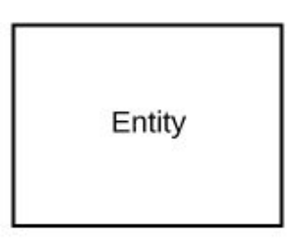
2. Attributes: Properties that describe an entity. 
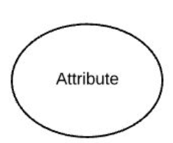
3. Relationship:A connection between entities.
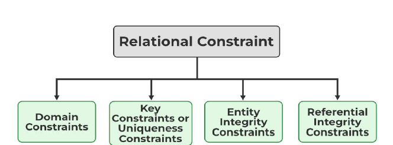

**Overall Simple ERC**
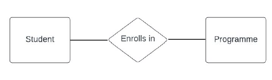

**Primary Key**
1. Primary Key uniquely identifies each entity in an entity set.
2. Ensures no two entities have identical values for all attributes.
3. Can be a single attribute or a combination of multiple attributes.
4. Essential for maintaining data integrity and avoiding duplication.
5. It must be unique and not null in the table.
6. Represented in an ER model by underlining the attribute.

**Adding Attributes**
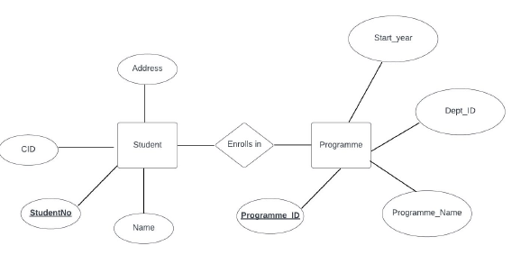
**Other Notation**
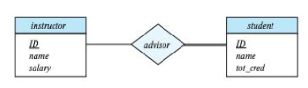

# Complex Attributes
1. Simple Attributes: Attributes are not divided into subparts.
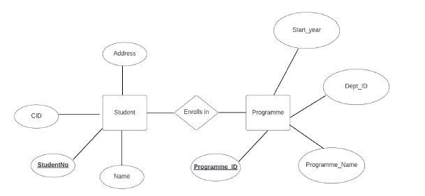
2. Composite Attributes: Attributes can be divided into subparts.
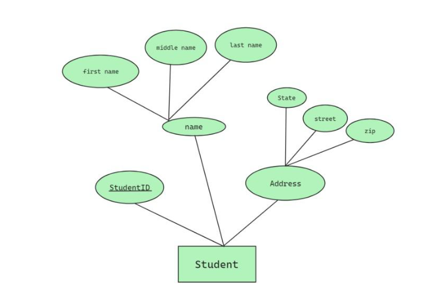
3. Single-valued Attributes have only one value for a specific entity.
4. Single-valued Attributes hold a single value for each entity instance.

5. Derived Attributes are calculated from other attributes or entities.
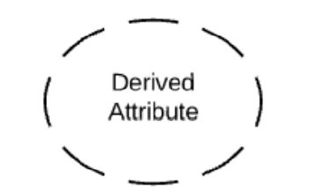

## Types of Attributes
**Mapping Cardinalities**
- Mapping cardinalities define how many entities can be related to another entity.
- They describe the relationship ratio between entities.

1. **One-to-One Relationship**: Each entity in A is linked to at most one entity in B, and vice versa.
**Example:** In a COMPANY database, an employee has one spouse, and a spouse is linked to one employee.
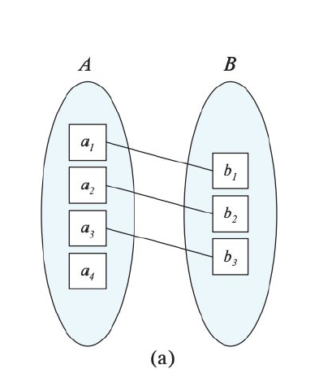

2. **One-to-Many Relationship**: A single entity in A can be linked to multiple entities in B, but each entity in B is linked to only one entity in A.
**Example:** One department can have many employees, but each employee belongs to one department.
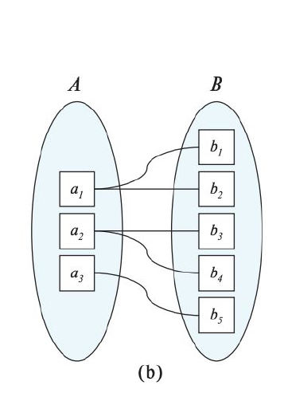

3. **Many-to-One Relationship**: Multiple entities in A can be linked to a single entity in B, but each entity in B is associated with only one entity in A.
**Example:** In a hospital, multiple surgeries are performed by one surgeon.
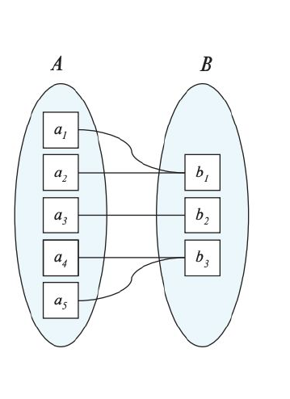

4. **Many-to-Many Relationship**: Multiple entities in A can be linked to multiple entities in B, and vice versa.
**Example:** An employee can work on multiple projects, and a project can have multiple employees. Similarly, a student can enroll in many classes, and each class can have many students.
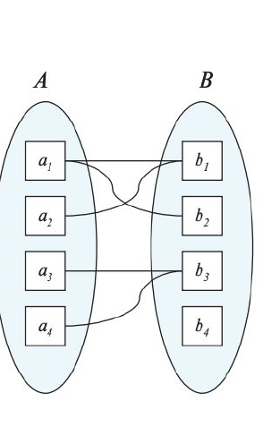

## ERD notations
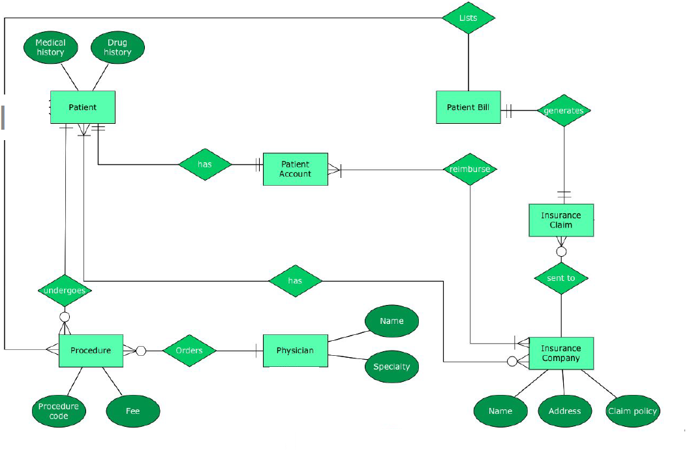
## Crow’s Foot Notation
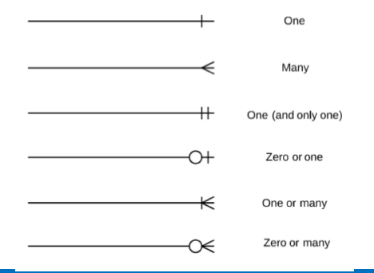

## Four main types of membership relationships:
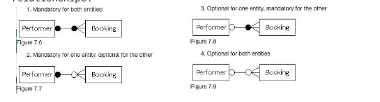

## Key
1. **Superkey:** A set of attributes that uniquely identifies an entity.
2. **Candidate Key:** A minimal superkey with no redundant attributes.
3. **Primary Key:** The chosen candidate key for unique identification.
4. **Secondary Key:** Used for data retrieval, e.g., Phone & Last Name.
5. **Alternate Key:** Candidate keys not selected as the primary key.
6. **Foreign Key (FK):** An attribute referencing a primary key in another table; it can be null and must match the data type of the primary key.
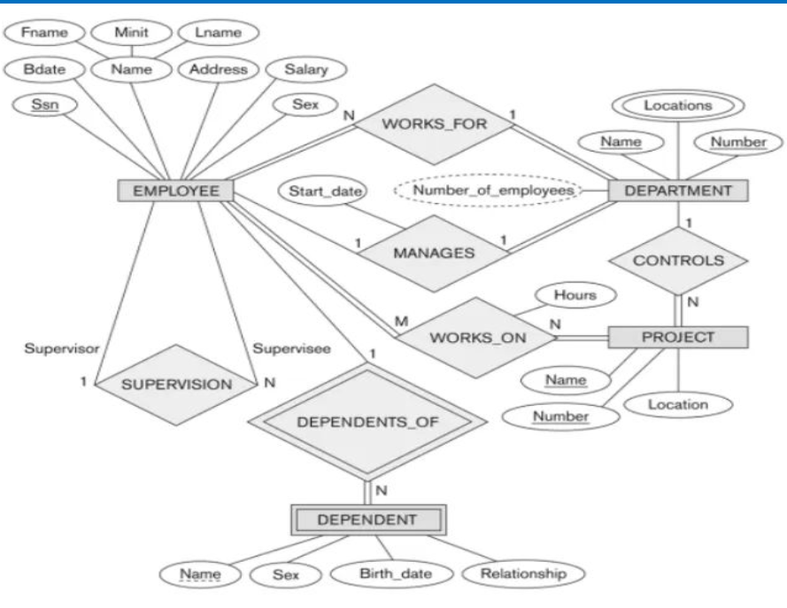

## Types of relationships
1. One to one
2. One to many
3. Many to many
4. Many to one
5. Ternary Relationships
6. Unary Relationship(Recursive)

1. **Ternary Relationships**
- A ternary relationship represents a many-to-many relationship among three entities.
- For n-ary relationships (n > 2), create a new table to represent the relationship.
- The primary key of this table is a combination of the primary keys of entities on the many side.
- In most n-ary cases, all participating entities have a many-side association.
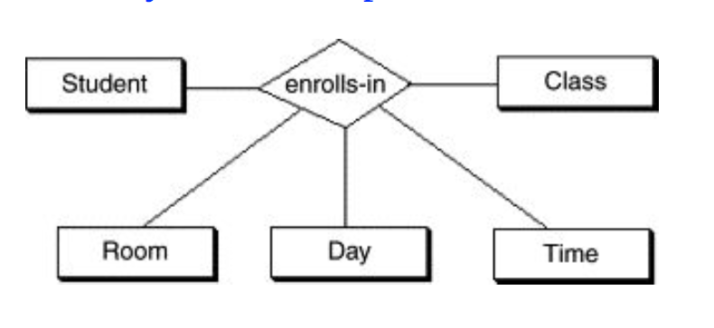

2. **unary relationship**
- A unary relationship (also called recursive) occurs within the same entity set.
- t represents a relationship between different instances of the same entity.
- The primary key and foreign key are the same but represent entities with different roles.
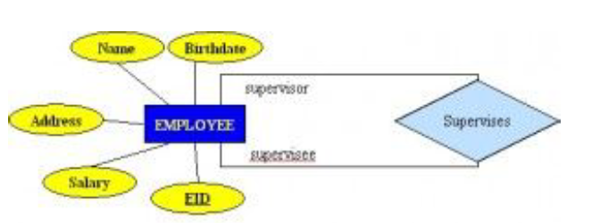

**Weak Entities**
- An entity type should have a key attribute to uniquely identify each entity.
- Some entity types lack a key attribute that can uniquely identify them.
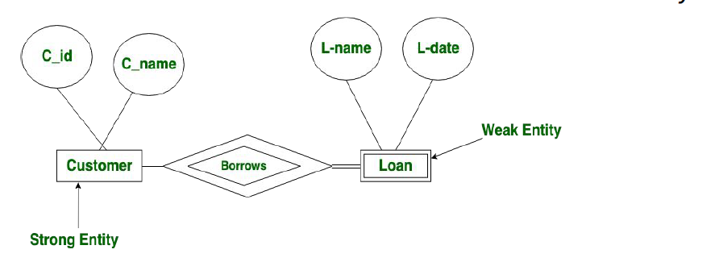

**Homework**
Draw an entity relationship diagram for the student registration system at CST?

## Removing Redundant Attributes
- A good entity-relationship design does not contain
redundant attributes.
**Extended E-R Features**
1. **Specialization:**
- An entity set may have subgroups that are distinct from others within the set.
2. **Generalization:**
- A higher-level entity contains one or more lower-level entity sets in a hierarchical relationship.

**Attribute Inheritance**
**Inheritance:**
- Attributes of the higher-level entity set are inherited by lower-level entity sets.
**Outcome of Specialization/Generalization:**
- A higher-level entity set with common attributes and relationships for all lower-level entities.
- Lower-level entity sets with unique attributes specific to each subgroup.

## Constraints on Specialisation/ Generalisation
1. **Membership constraints**
**Condition-Defined:**
- Membership is determined by a specific condition in the requirements.
- **Example:** A tanker is a ship where cargo = 'shoes'.
User-Defined Specialization/Generalization:
- The designer defines the superclass-subclass relationship.
Used to simplify the design model or represent complex entity relationships.

2. **Disjoint constraints**
- Applies when a superclass has multiple subclasses.
- An entity can belong to only one subclass at a time.
**Example:** A student can be either a postgrad or undergrad, but not both.
- Used to represent a disjoint superclass-subclass relationship.

**Overlapping:**
- Applies when a superclass has multiple subclasses.
- An entity can belong to only one subclass at a time.
**Example:** A student can be either a postgrad or undergrad, but not both.
- Used to represent a disjoint superclass-subclass relationship
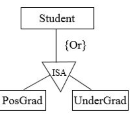

## Completeness constraints
**Partial:**
- Some superclass entities may not belong to any subclass.
**Example:** Some people at UCT are neither students nor staff.
- The keyword {Optional} represents this type of relationship.
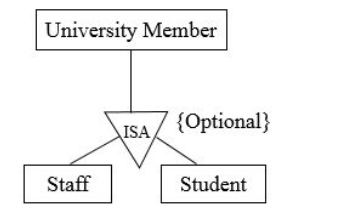

## Aggregation
**Limitation of E-R model:** Cannot express relationships among relationships.
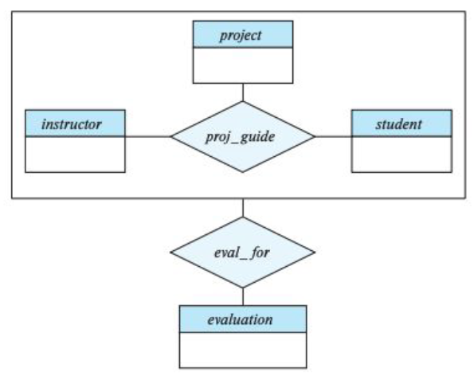

**Aggregation**
- Aggregation is a concept that allows relationships to be treated as higher-level entities, providing an abstraction for complex relationships.

## Highlights (lesson_4,5 and 6)
1. Understand the Database Design Process
2. Understand Relational Data Models
3. Explain Entity-Relationship Diagrams
4. Identify Complex Attributes
5. Map Cardinalities Between Entities
6. Determine Primary Keys in Entity Sets
7. Remove Redundant Attributes

## Relational Model
1. **Structure:** Defines the relationships and content of the database.
2. **Integrity:** Ensures that the database adheres to specified constraints.
3. **Manipulation:** Provides a programming interface for interacting with and modifying the database's data.

## Relational Model Structure
- A relation is an unordered collection that includes the relationships of attributes representing entities.
- A tuple consists of a set of attribute values (also referred to as its domain) within the relation.
- The values are typically atomic or scalar.
- The special value NULL can be part of any domain, if permitted.

## Relational Database Terms
**Relation** - A Table
**Tuple** - Row of the table
**Attribute** - Column of the table.
**Database schema** - logical design
**Database instance**- snapshot of the database at a given instance of time.
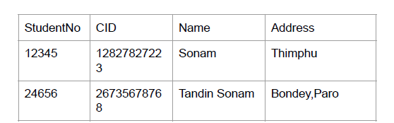

## Relational Model:
**Primary Keys**
- The primary key of a relation uniquely identifies each tuple.
- Some DBMSs automatically generate an internal primary key if one is not explicitly defined for a table.
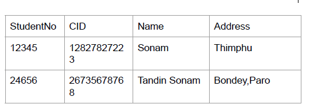

- A relation's primary key uniquely identifies a single tuple (row) in a table.
- Some DBMSs automatically generate an internal primary key if one is not explicitly defined in the table.
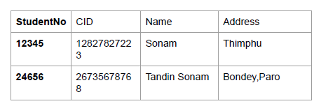

**Foreign Keys**
- A foreign key ensures that an attribute in one relation corresponds to a specific tuple in another relation.
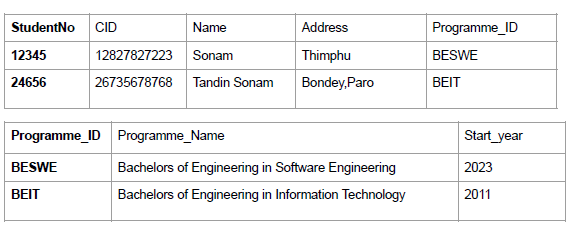

## Relational Model Keys
1. **Superkey:** A set of one or more attributes that uniquely identify a tuple in a relation.
**Example:** dep_id or a combination of dept_id & dept_name.
2. **Candidate Key:** An attribute or a combination of attributes that uniquely identify each tuple in a relation.
**Example:** CID in the student table, or a combination of student_name and student_id.
3. **Primary Key:** A candidate key selected by the database designer as the main identifier for tuples in a relation.

## Schema Diagrams
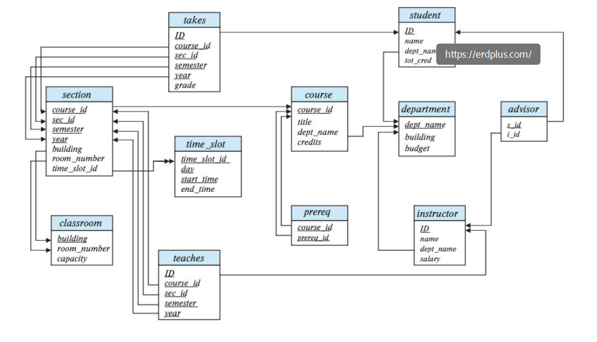

# ERD to Relational Schema
- The E-R model and the relational database model are both abstract, logical representations of real-world enterprises.
- Since both models follow similar design principles, an E-R design can be converted into a relational design.

## Reducing E-R Diagrams to Relational Schemas
Create a table for each entity type.
- All single valued attribute becomes a column for
the table.
- Primary key attribute of entity → Primary key of
table.
2. Multivalued attribute is represented by a separate
table.
3. For composite attributes, only the sub attributes
are made into columns of the table.
4. Derived attributes are not made into columns  5. Relationship sets are converted to relations with
attributes made up of the union of the primary keys
of the participating entity sets.
- Descriptive attributes of the relationship set are
also included Relationship sets;
- The primary key consists of the primary key of
- one of the participating entity sets if the
relationship set is many-to-one or one-to-one
or many-to-many.Foreign key constraints are
added referencing the participating entity
sets. can you write different words with short with bullet point

